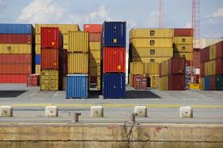

# IN THE WORLD OF UNUSUAL CONTAINERS AND IMAGES


# TABLE OF CONTENTS

## [INTRODUCTION](#introduction) (Parichay)
## [ABOUT DEVOPS](#about-devops) (DevOps k baare m)
## [WHAT IS AN IMAGE ?](#what-is-an-image-) (Image kya h?)
## [CONTAINER](#container)
## [IMAGE BUILDING](#image-building) (Image ko banana)
## [IMAGE RUNNING](#image-running) (Image ko chalana)
## [CONTAINER RUNTIME](#container-runtime) (Container ko chalane wala)
## [CONTAINER REGISTERIES](#container-registeries) (Container images ka godown)


## [INTRODUCTION]

Is document mein main **Images** ke baare mein samjhaunga (yahaan hum jpg ya png images ki baat nahi kar rahe jo aam tor pe hum sab jaante hain). Yeh wo Images hain jo hum **DevOps** mein use karte hain, aur saath hi yahaan **Containers** ke baare mein bhi jaankari di jayegi (jo thode bahut waise hi hain jaise hum sochte hain, lekin unse kaafi alag bhi hain).

## About `DevOps`

**DevOps** ek aisi methodology hai jo Development (Dev) aur Operations (Ops) teams ke beech collaboration ko enhance karne ke liye bani hai. Iska main goal yeh hota hai ki software development aur deployment process ko zyada fast, reliable aur efficient banaya ja sake. Isme development team aur IT operations team milkar kaam karte hain, taaki code jaldi se jaldi production mein ja sake, bina kisi breakdown ke.


## [WHAT IS AN IMAGE ?](#what-is-an-image-) (Image kya h?)

DevOps mein **Images** ek tarah ka blueprint hote hain jo container ko banane k liye use kiya jata h. Ek **image** k andar wo sab kuch hota h jo apke application ko run karne k liye chahiye hota h ---> jaise code, libraries,external dependencies.

* Ye ek read-only template aur ready-to-use software hota h.
* Images source codes,libraries, external dependencies aur tools se banti h.
* Images ko ek baar banne k baad update ni kar sakte.
* Agar Image mein koi changes karne h to new image bananin padhegi.
* Images directly run nahi kar sakte.

`Examples`
* Application tools and libraries
* Node js setup
* React setup
* Application ka code
* Any other supporting tool

## [CONTAINER](#container)


Container ek lightweight virtual environment hai jisme hum ek application aur uske dependencies ko isolate kar sakte h, bina pure operating system ko virtualize kiye. Containers ek tarike ka package hai jo aapke code ko chalayega same tarike se chahe hum development, testing, ya production environment mein ho. 

Sabse common containerization tool Docker h. Ye containers ko build, run, aur manage karne mein help karta h. Container k andar jo bhi chal raha hota h, woh aapke main system se alg hota h,isliye agar application ek container mein break hota h, to baaki system p koi asar nahi padta.

## [IMAGE BUILDING](#image-building)

Image building ka matlab h ek ready-to-run environment banana jo ek specific application aur uski dependencies ko include karta h. Image ko banane k liye commonly `Docker` ya similar tools ka use hota h.

Docker Image build karne k steps:-
`Step 1:` Dockerfile likhna: Ye ek plain text file h jisme instructions hote h ki hamara image kaise buikd hoga. Jaise konsa base image use hoga
(e.g, Ubuntu,Alpine), konsa code copy karna h, dependencies install karni h, aur konsa command chalana h jab container start ho.

#### EXAMPLE DOCKERFILE

```
`FROM  python:3.9-slim`
  (ye base image h)

`WORKDIR /app`  (Kaam ki directory batana)

`COPY requirements.txt .`  (requirements file copy karna)

`RUN pip install -r requirements.txt` (Dependencies install karo)

`COPY . .` (apne app ka code copy karo)

`CMD ["python", "app.py"]`   (App ko run karne wala default command)
```

`Step 2:` Docker Image ko build karna: Jab Dockerfile ready ho jata h, tab hum command chala kar image build karte h is command se:

`docker build -t myapp:latest .`

Is command mein:-
* `-t` flag tag assign karta h (yaha `myapp`)
* `.` current directory ko specify karta h jaha Dockerfile h.

`Step 3:` Image ko check karna: Build hone k baad, hum image ko dekh sakte h `docker images` command se.

## [IMAGE RUNNING](#image-running)

Container image run karna matlab ek container ko start karna, jo us image k andar packaged application ko execute karega chalayega.

`Steps to Run a Docker Image:`

`Step 1:` Build ya Pull Docker Image: Agar hamare paas koi image pehle se to hum directly run kar sakte h, agar nahi h, to phle image banani padegi ya Dockerhub se pull karni padegi.

Example:
```
docker pull nginx
```
Is command se hum nginx image ko Docker Hub se apne local system p download kar sakte h.

`Step 2:` Image ko run karna:
jab Image ready ho, hum `docker run` command se use container k form m chala sakte h.

Command:
```
docker run myapp
```
* `docker run`: Container start karne k liye command
* `myapp`: Image ka naam ya tag jo run karna h.

Agar hume background m run karna ho (detached mode), to `-d` flag use karte h:
```
docker run -d myapp
```
`Step 3:` Port forwarding: Agar container ek network service (jaise web server) run kar raha h, aur hume access karna h, to port forwarding use hoti h:

Example:
```
docker run -d -p 8080:80 myapp
```
* `-p`: Ports map karta h. Yaha host ka port `8080` container k `80` port p map hoga matlab application `8080` port par chalega.

`Step 4:` Container ko name dena: Hum container ko ek custom name de sakte h `--name` flag se:
```
docker run -d --name mycontainer myapp
```
`Step 5:` Check Running Containers:
Container ko check karne k liye is command ko use karte h:-
```
docker ps
```

`Step 6:` Container Stop Karna: Container stop karne k liye ye command hota h:-
```
docker stop mycontainer
```


## [CONTAINER RUNTIME](#container-runtime)

Container runtime ek software h jo container ko run karne k liye zaroori functions provide karta h. Ye runtime container image ko execute karta h, unko isolate karta h, aur system resources (CPU, memory, file, system,etc.)  allocate karta h.

### Common  container runtimes
## 1. `runc:`
* Sabse zyada use hone wala runtime h.
* Ye Open Container Initiaitive (OCI) ke standard ko follow karta h.
* Lightweight aur low-level runtime h, jo linux containers ko run karta h.
* Docker aur kubernetes mein commonly use hota h.
## 2. `youki`
* Rust mein likha gaya ek OCI-compliant lightweight container runtime h.
* Iska focus simplicity aur better performance p h.

### Container Runtime k kaam:
* Image ko pull karna.
* Container ko start karna. 
* System resources manage karna.
* Processes ko isolate karna.


## [CONTAINER REGISTERIES](#container-registeries)

Container registeries wo repositories hote h jahan container images ko store aur distribute kiya jata h. Ye registry hume container images ko share karne, version control maintain karne, aur deploy karne ka ek centralised platform deti h.



### Types of Container Registeries:
#### 1. Public Registeries: 
* Publically accessible hote h. Koi bhi in registeries se images ko pull kar sakte h.
Example: `Docker Hub`,
`Github Container Registry`,
`Google Container Registry`

#### 2. Private Registeries: 
* Private organizations ya individuals k liye hote h jo apne images ko secure aur private rakhna chahte h.
* Private registeries ka use production environments mein hota h jahan sensitive applications k images store kiye jaate h.

#### Advantages od Using Container Registeries: 
* Centralized storage hota h.
* Access Control
* Integration with CI/CD

#### Example of a Container Registry Flow:
* `Build` : Developer ne ek Docker image banayi apne local system p.
* `Push` : Us image ko Docker Hub ya kisi private registry pe push kiya.
* `Deploy` : Kubernetes ya Docker-compose ne us registry se image pull kiya aur environment mein deploy kiya.
